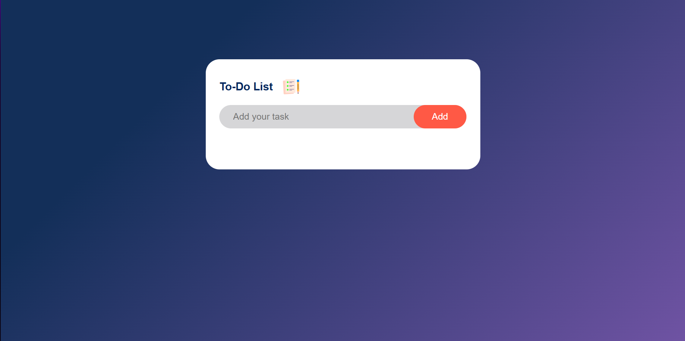

# To-Do List ✅

A simple and responsive To-Do List web application built using HTML, CSS, and JavaScript.  
This project was created to practice frontend development and understand the complete workflow of building a UI-based application from scratch.

## 📌 Features
- Add new tasks with ease
- Mark tasks as completed
- Remove tasks
- Persist tasks using `localStorage`
- Clean and responsive UI design

## 🛠️ Technologies Used
- HTML
- CSS
- JavaScript
- `localStorage` (for saving tasks even after browser reload)

## 📷 Preview 



## 📁 Folder Structure
├── index.html
├── style.css
├── script.js
└── images/


## 🚀 How to Run Locally
1. Clone the repository
   ```bash
   git clone https://github.com/aryandas2911/To-Do-List.git   
   cd todo-list

3. Open index.html in your browser
